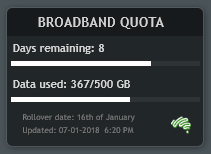

# AussieBroadband Usage Meter
AussieBroadband usage meter skin for Rainmeter.

Originally made by Kanine and adapted for Aussie Broadband by HD on the whirlpool forums
 - [Bigpond Usage Meters](https://forums.whirlpool.net.au/forum-replies.cfm?t=1942079&p=9#r170)
 - [Aussie Broadband Usage Meters](https://forums.whirlpool.net.au/forum-replies.cfm?t=2679153&r=55439756#r55439756)

[Desktop preview](BOM-illustro-preview.jpg)

## Installation steps
1) Install [Rainmeter](https://www.rainmeter.net/)
2) Download [AussieBroadBand Usage Meter_0.02.rmskin](/AussieBroadBand%20Usage%20Meter_0.02.rmskin)
3) Run the .rmskin to install it with Rainmeter, use Manage Rainmeter to add it to desktop, you will be propted for your Aussie Broadband login details that will be encrypted and stored locally.
4) There will be two (or more) .ini skin files:
 - The original ABB.ini by HD
 - illustro-ABB.ini matching Rainmeters default 'illustro' skins.
'Select' > 'Load' the one you want.

## Additional
See also: Bureau of Meteorology Rainmeter skin by Kanine [bomweather](https://github.com/kanine/bomWeather)
and a a set of illustro skin options for it here: [bomweather](https://github.com/jaydenmorris1/bomWeather)
