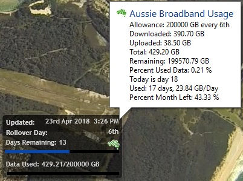
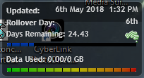
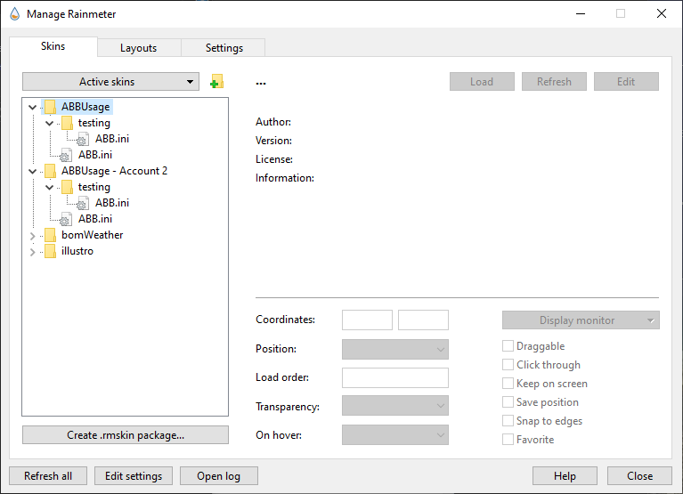

# Aussie Broadband Usage Meter
AussieBroadband usage meter skin for Rainmeter.

Originally made by Kanine and adapted for Aussie Broadband by HD, jandakot11 and Big Kahuna on the whirlpool forums

## Installation steps
1) Install [Rainmeter](https://www.rainmeter.net/)
2) Download [Aussie Broadband Usage 0.34.rmskin](/Aussie%20Broadband%20Usage%200.34.rmskin)
3) Run the .rmskin to install it with Rainmeter, use Manage Rainmeter to add it to desktop, you will be propted for your Aussie Broadband login details that will be encrypted and stored locally.



4) There will be seven .ini skin files:

There are variants with a solid bar (see above), 5px and 8px as well as dashed bar 5px (see below) and 8px. The Data used bar is graded in colour from green to red. Also included are HD's original and Jayden's modified skin. The ABB.ini skin is the same as the 5px image one and is my current favourite skin.

I also just streamlined the tooltip a bit from the one in the screenshot here.

The graded skins look like this:



The Manage Skin Screen looks like this:



In Rainmeter, select Manage Skins and in the Aussie Broadband folder select abb.ini and load it (see above graphic).
Note you can change transparency in that panel.

On the main skin, clicking the ABB icon will load the customer portal at Aussie.

On first load it will prompt for ABB username and password

In this version, I added a calculation to take into account how much of the current day has been used for days remaining and also days used and am using that to give a more accurate estimate of daily use. I am also now showing the Allowance per day at start of month and remaining with the other information in the tooltip as per the image here.

If you are over your quota for this stage of the month the percent used bar will be red.

#######MAJOR CHANGES 0.34#######

So I made some major changes in this version. I have moved all the colours and images from being scattered in the .ini file to now all being specified in the variables section. If you edit the abb.ini file (or any of the others except HD's and Jayden's) scroll down to line 21. It looks like this:

```
[Variables]
fontName=Trebuchet MS
textSize=8
colorBarDays=8,71,174,255
colorBarData=34,177,76,255
colorBarOver=255,0,0,255
colorText=255,255,255,205
fontEffectColorSet=0,0,0,20
solidColorSet=0,0,0,255
;Set the bar size and type. Valid Options are solid5px, solid8px, image5px, image8px
barStyleSize=image5px
;Set the nominal allowance if required. 0 means value is read from ABB otherwise enter GB allowance (so you see data used bar)
nominalAllowance=0
```

Here, you can set the bar colours for a solid bar for Days remaining, Data Used and a data used colour that indicates you will go over your allowance based on usage in the month to date. As a default I'm using blue (8,71,174), green (34,177,76) and red (255,0,0) for these as above. The 4th term in the colour is the alpha value, 255 for each.

I have also made it possible to set the meter to use either a solid bar or an image and to set the size of these to 5px or 8px. Set the variable barStyleSize to one of the 4 VALID options as shown. You can change the solid bar colours as above and if you wish to change the image, you can make your own and replace or add to my images. You'll need to look for the bar meters below and edit those as well if you want to do this.

Additionally, if you are on an unlimited plan, the data used bar will always be blank as there is no 'limit'. To alter this behaviour, as shown above, you can set a nominal limit in GB and the meter and percentages will use that instead of the ABB downloaded measure. Set it back to 0 if you want to 'go' unlimited again.
