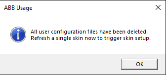
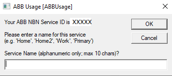
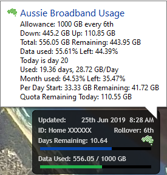

# Aussie Broadband Usage Meter
AussieBroadband usage meter skin for Rainmeter.

## Credits and information
Originally made by Kanine and adapted for Aussie Broadband by HD, jandakot11, Protogen and Big Kahuna on the whirlpool forums

Original Inspiration: [Kanine's Bigpond Skin](http://sourceforge.net/projects/bigpond/)

[HD's ABB Original](https://www.dropbox.com/sh/rurvj80pp12lvkj/AAAI5EmF5BHDSpeezSqHJouBa)

[Jandakot11's ABB Modified](https://github.com/jaydenmorris1/AussieBroadband-Usage-Meter)

HD's and Jayden's skins are no longer distributed in the RMSKIN file but versions that work with the new scripts are available still in the ABBusage folder in this repository.

Thanks also to nclemeur for identifying and fixing a password issue with complex passwords. (Original ABB Portal)

BIG THANKS to Protogen for updating the scripts to work with the new Aussie Broadband Portal and other assistance in enabling multiple accounts and services to be used.

## Installation steps
## IMPORTANT NOTE If you are upgrading from a previous release of this skin, make sure you read the changelog below as everything has changed!
1) Install [Rainmeter](https://www.rainmeter.net/) (Minimum Version 4.1)
2) Download [Aussie Broadband Usage 0.80.rmskin](/Aussie%20Broadband%20Usage%200.80.rmskin)
3) Run the .rmskin to install it with Rainmeter, The abb.ini skin should be automatically loaded once installed otherwise use Manage Rainmeter to add it to desktop.
4) There will be 2 script files installed. One called ABB-Clean.vbs will delete all information currently stored and will give a message:

Then refresh the skin (right click on it and select refresh) and follow the prompts.

5) You will be prompted for your Aussie Broadband login details. 

You will then see a message about obtaining an authentication cookie from Aussie Broadband

Next you will be prompted for some display options for the skin. If you are using multiple skins, you can have different options set for each skin! Enter a number between 1 and 4 to set the style required. (You can edit this later if you wise - see below)

[Select Bar Style & Size](bar_style_size.pbg)

Next you will be prompted for the font size - enter a number between 1 and 3. The font size selected will also set the size of the usage meter. (Again, you can edit this later if you want to, see instructions below)

Next it will ask if you wish to overide ABB usage allowance. This is really only applicable for users on an unlimited plan. Almost always you will not want to do this so click NO. If you wish to track your usage (and see a usage bar for allowance used like you would if you were not on an unlimited plan then enter a value in GB here)

![Use a Limit?]overide_usage.png)

Next you will be prompted to enter a service name for your service. eg Home or Work etc.

You will now most likely see a blank box like this:

Simply right click on the box and select Rfresh Skin and you should see data flowing in.

## Note about usage display and ABB's API.
I have found in practice that the data available from Aussie Broadband can be up to 1 hour old (despite claims that it refreshes every 15 minutes). If you log onto my Aussie or use the mobile app, you will see the same data being reported in the app as in this skin. It is just the way the ABB API works and nothing can be done about this in the skin or any other usage meter.

## Changing the selected options.
To change the options (bar size, style or font size) or the service friendly name, double click on the ID: Name XXXXX

## Username and Password
The Username and Password are no longer stored (since version 0.71) as we obtain a cookie and refresh token as per the changelog. IF you change your password, the credentials will be invalidated and you will be prompted to go through the initial setup again. You will also be prompted to give the service a friendly name that will now be displayed on the skin as well.

## Example skins
These examples don't show the new ID and service but otherwise are what you should see.

6) There will be one abb.ini skin file:
Changing Font size, bar size and style via editing the abb.ini file is no longer supported.
The mid and large font skins are now selected via the entered options instead of using a different skin.

The progressive image skins look like this:

The Manage Skin Screen looks like this:

In Rainmeter, select Manage Skins and in the Aussie Broadband folder select abb.ini and load it (see above graphic).
Note you can change transparency in that panel.

On the main skin, clicking the ABB icon will load the customer portal at Aussie.

For limited plans, I added a calculation to take into account how much of the current day has been used for days remaining and also days used and am using that to give a more accurate estimate of daily use. I am also now showing the Allowance per day at start of month and remaining with the other information in the tooltip as per the image here.

If you are over your quota for this stage of the month the percent used bar will be red.

Unlimited plans don't show the lower data percent used bar and don't show any of the allowance statistics in the tooltip. 

NOTE: Some users have problems with default secure protocols (I've had reports from users running Windows 7, 64 bit) Applying a [Microsoft hotfix has been reported to fix this](https://support.microsoft.com/en-us/help/3140245/update-to-enable-tls-1-1-and-tls-1-2-as-a-default-secure-protocols-in#easy)

## Multiple Services for the one account
To use this feature, create a new directory in the ABB usage folder and copy the ABB.ini skin to that folder. Any folder under ABBUsage (the default) will use the SAME ABB logon username/password and the same cookie. In the next release (coming soon) multiple accounts will be detected as part of the setup.

## Multiple Accounts
Say you are wanting to monitor usage for your work and your home or for a friend - so this would be different accounts. To do this, you will need to duplicate the entire ABBUsage folder (C:\Users\YOUR_USER\Documents\Rainmeter\Skins\ABBUsage to say C:\Users\YOUR_USER\Documents\Rainmeter\Skins\ABBWorkUsage) When you use the manage screen to load that skin from a new folder it will ask for setup credentials for the new account as well as style information.

## Security and Password Encryption/Encoding
The Username and Password are no longer stored as we obtain a cookie and refresh token as per the changelog. IF you change your password, the credentials will be invalidated and you will be prompted to go through the initial setup again.

## Changelog
## New in version 0.80
- Uses options when setting up to select bas style and size as well as font size instead of having seperate sking.
- Data xml files are no longer stored in the scripts folder 
- multiple user accounts is supported
- multiple user services for the one account are supported
- double-click on the abb icon, not the skin to load the abb portal
- double click the ID: Name XXXX field to re-enter the options

0.71 Sunday 14th April 2019 Remove debug and restore refresh token to 1/2 cookie life.

## New in version 0.70
We are now using the new Aussie Broadband Portal which uses a cookie and a refresh token to download usage once you have authenticated. The cookie is valid for 1 year. The first time you open the new skin, you will be required to enter your ABB Username and Password to authenticate. This will then download a cookie and refresh token from ABB. When the cookie is at it's half life, the script will automatically use the refresh token to get a new cookie and refresh token. You will also be prompted to enter a description for your service. This description and service ID will be shown on the skin. This is also to facilitate an upcoming change in mid May to allow multiple services to be monitored.

